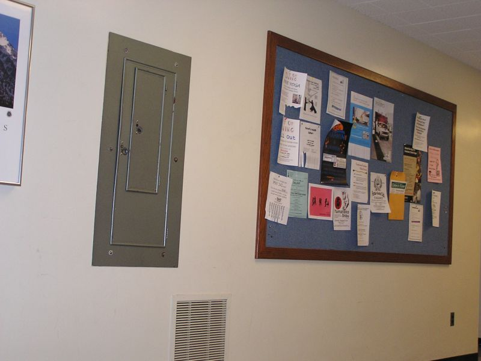
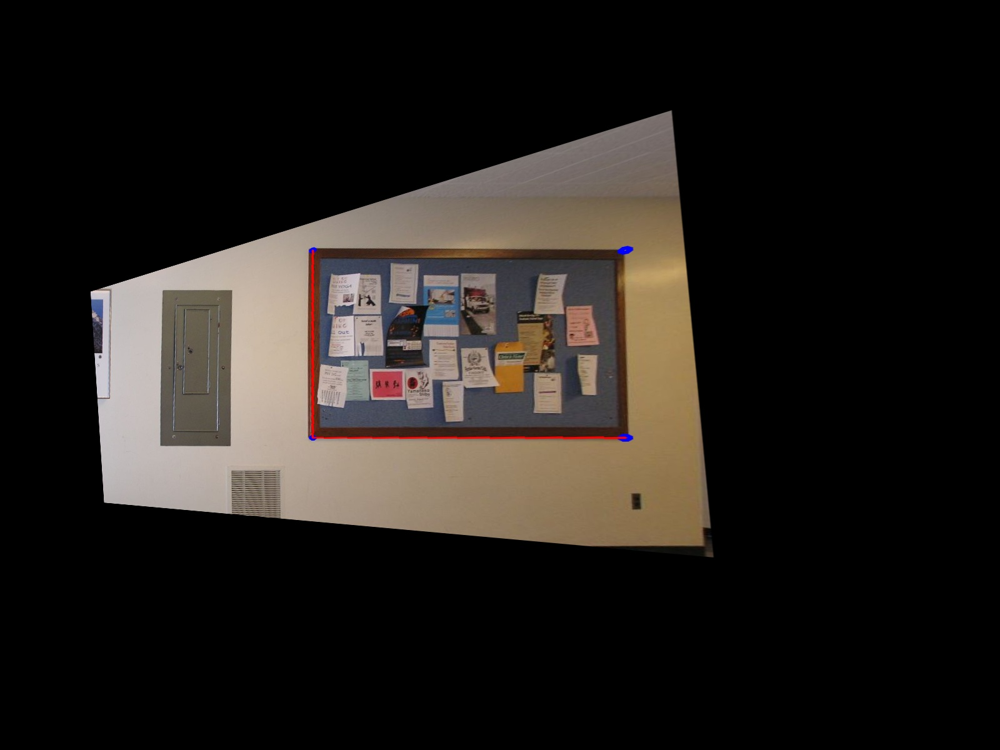
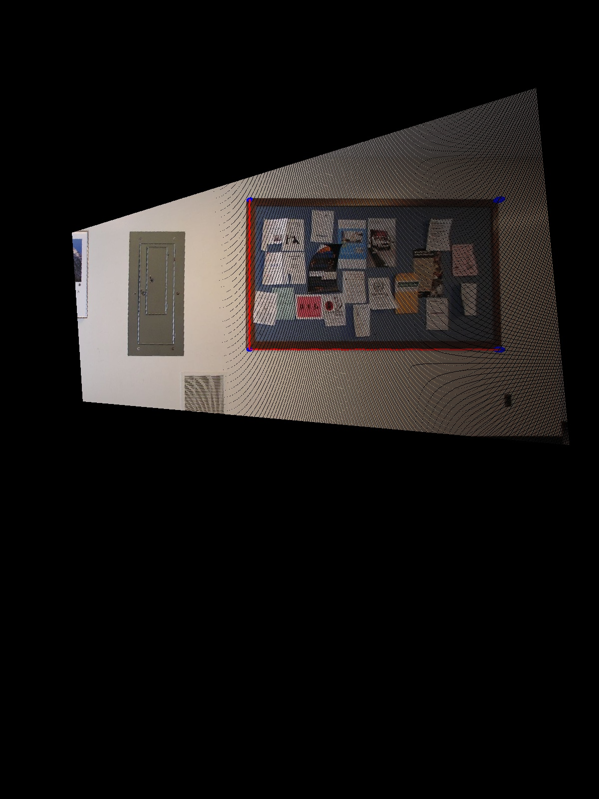

# Projective Transform Rectification

### Background

The purpose of this program is to accept an input image that has a warped perspective and shift the perspective so as to make the image appears as if it was taken orthogonally.

The assignment comes in two version of the program:
 * `builtin.py`
 * `manual.py`

`builtin.py` utilizes two OpenCV methods to remove projective distortion from a supplied input image. A user can edit points that correspond to corners of a rectangle within an image along with a set of points that the rectangle should be mapped to in the desired view. The first function is `findHomography()` which determines the H matrix that maps a set of world points to image points and the method `getPerspectiveTransform()` performs roughly the same task. Finally, the `warpPerspective()` method applies the homohegraphy matrix `H`, found by one of the previous two methods, to the input image.

`manual.py` accomplishes the same task but manually. The provided report.pdf file within `report/` contains a PDF explaining the math behind projective transformation.

### Results
**__Built-In__**
**Before**

**After**

**__Manual__**
**Before**

**After**

