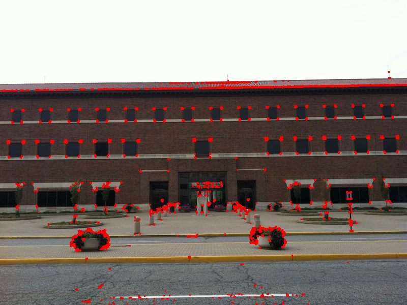
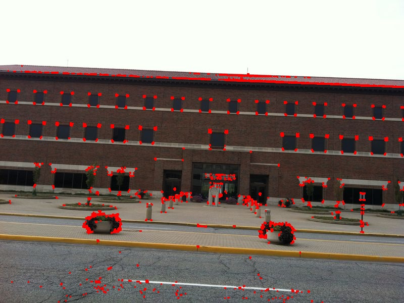
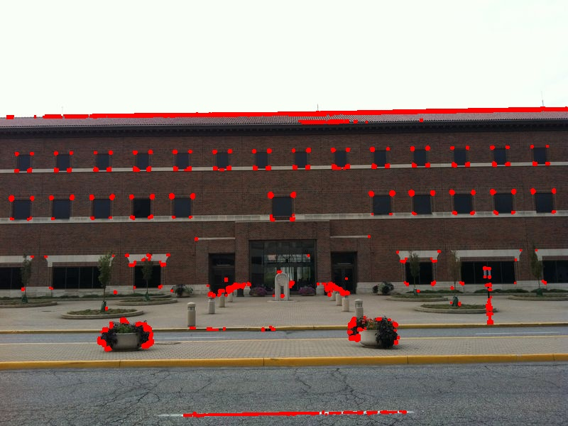
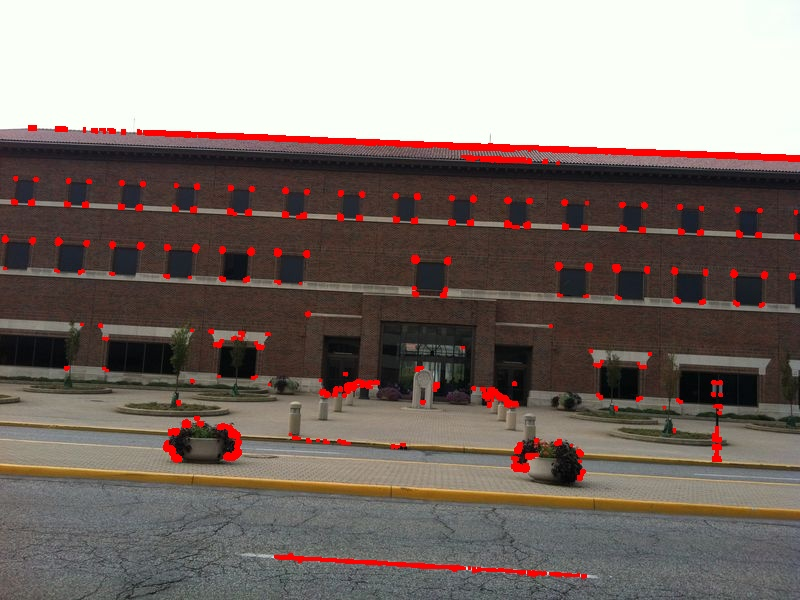

# Harris Corner Detection

This project was created as an alternative to the easy-to-use, fast, and efficient OpenCV `cornerHarris()` function. But why would we do something fast and efficiently, when we can learn it from the ground up and apply it in a frustratingly slow way? There are two version of the same program to compare these performances:

 * `builtin.py`
 * `harris.py`

`harris.py` was built for the purpose of this project and represents a manual creation and application of the harris corner detection algorithm written iteratively. `builtin.py`, on the other hand, accomplishes the same tasks, but does so using OpenCV's builtin `cornerHarris()` function.

## Prerequisites/Installation
`git clone https://github.com/smit2300/cv-processing.git`
`pip install -r requirements.txt`

## Running the Program
Example execution of `harris.py`:
`python3 src/harris.py -i input/sample-a.jpg -o input/new-sample-a.jpg`

Example execution of `builtlin.py`:
`python3 src/builtin.py -i input/sample-a.jpg -o input/new-sample-a.jpg`

This will use the input image, specified with the `-i` flag as input and output the corners of said image into the output directory specified with the `-o` flag.

## Results
### `builtin.py`

### `harris.py`

