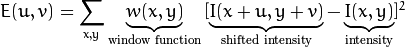
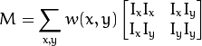
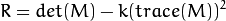

# Corner Detection

### Harris Corner Detection
Main goal of this algorithm is to take a window in an image and determine the difference in intensity for a displacement of `(u,v)` in all directions.

The window function gives weights to the pixels underneath it. Then the goal of Harris detection is to maximize `E(u,v)`.

Using Taylor Expansion:

`I` is a given directional image derivative.

Finally, the likelihood that a window contains a corner is given by:

det(R) = λ1λ2
trace(M) = λ1 + λ2
λ1 and λ2 = eigenvalues of M

The eigenvalues of M can give clear probabilities of corners. The eigenvalues both being large means a corner is likely, one being much larger than the other means a horizontal or vertical edge, and both being small means you have a flat region.

When the eigenvalues are both large that means that `E(u,v)` is increasing in all directions.
